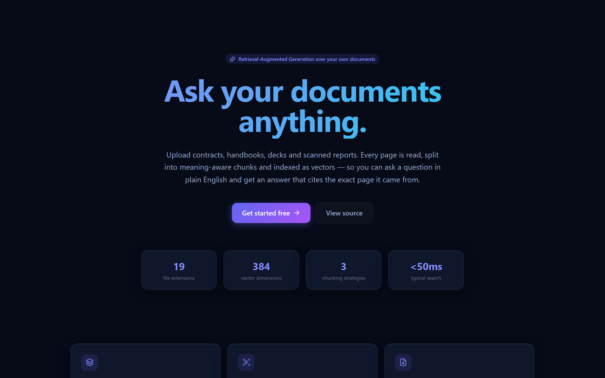
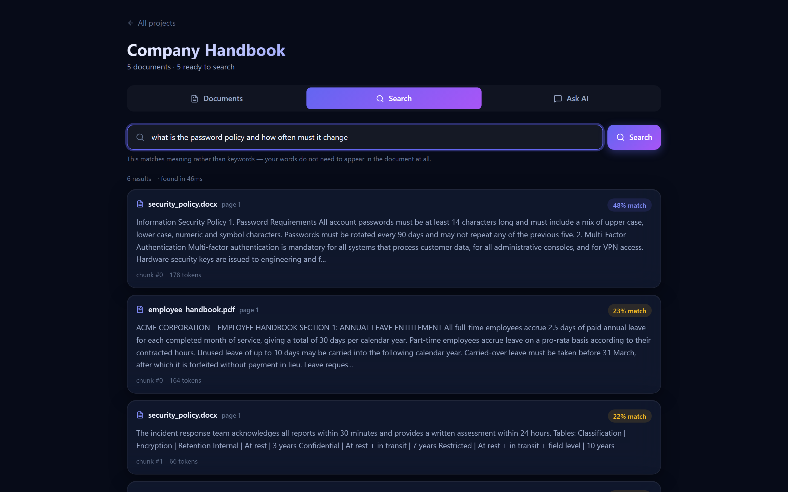
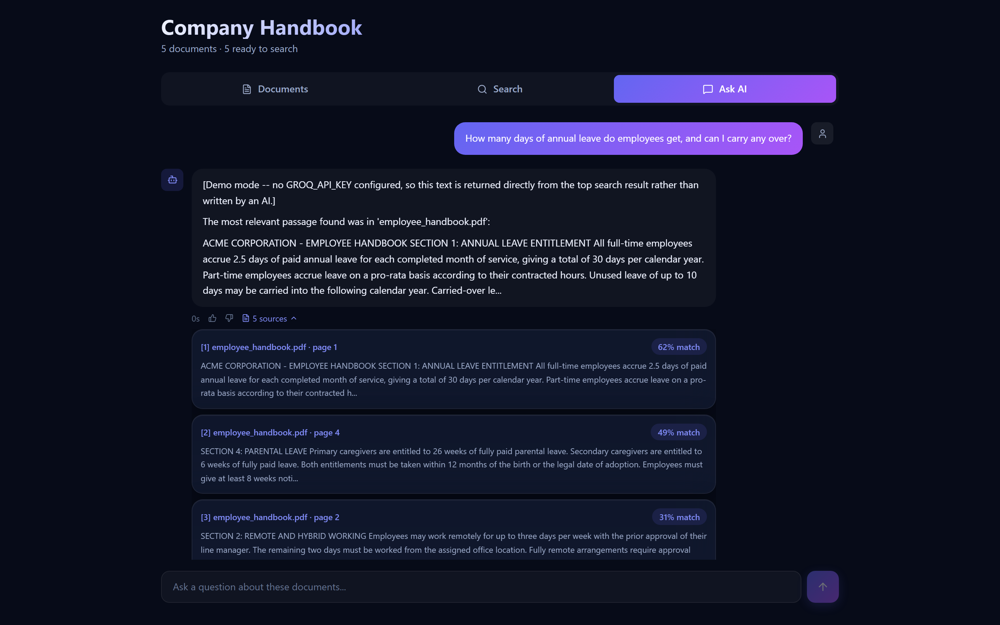
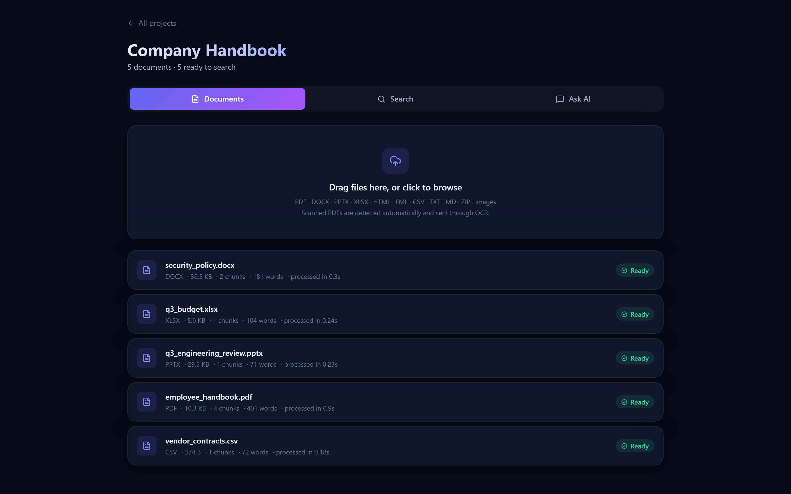
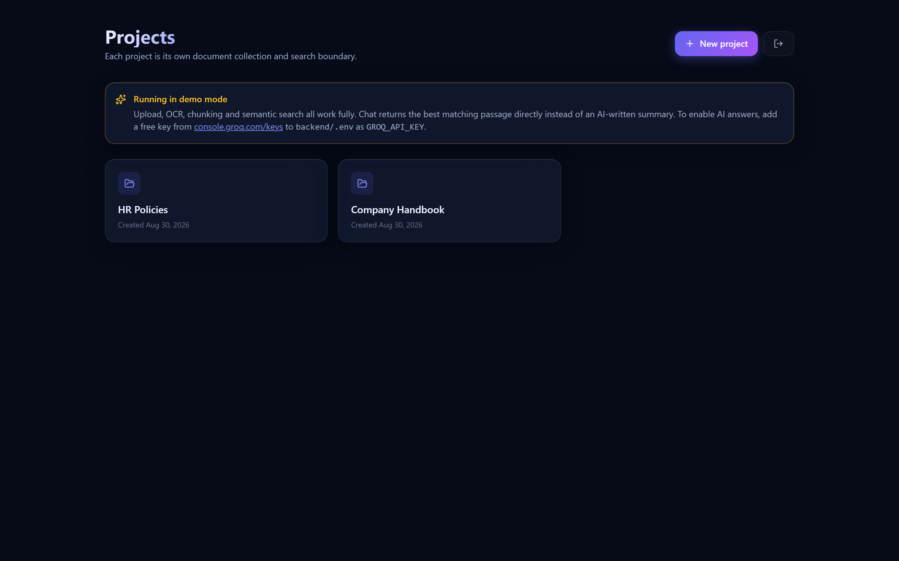
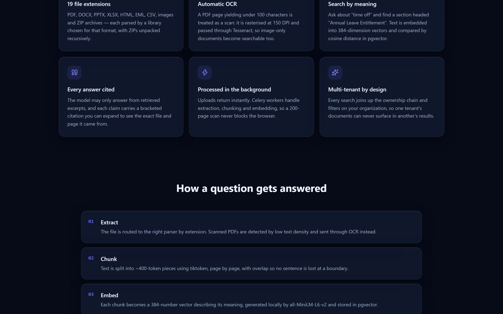
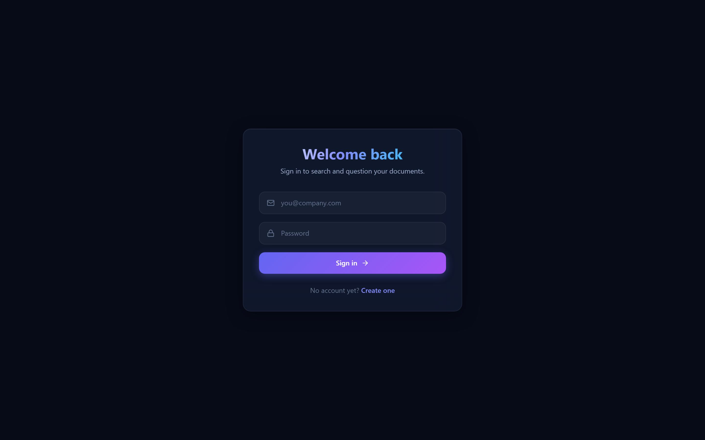

<div align="center">

# DocPilot

**Upload documents in 19 formats. Ask questions in plain English. Get answers that cite the exact page.**

A production-shaped **RAG** (Retrieval-Augmented Generation) platform: multi-tenant FastAPI backend, PostgreSQL + pgvector for semantic search, Celery workers for background ingestion, and an animated Next.js frontend.

[](https://www.python.org/)
[](https://fastapi.tiangolo.com/)
[](https://github.com/pgvector/pgvector)
[](https://nextjs.org/)
[](https://docs.celeryq.dev/)
[](https://console.groq.com/)



</div>

---

## Table of contents

- [What this actually does](#what-this-actually-does)
- [Screenshots](#screenshots)
- [How RAG works here, step by step](#how-rag-works-here-step-by-step)
- [Architecture](#architecture)
- [The 19 supported file extensions](#the-19-supported-file-extensions)
- [Tech stack and why each piece is there](#tech-stack-and-why-each-piece-is-there)
- [Quick start](#quick-start)
- [Where to put your API keys](#where-to-put-your-api-keys)
- [Deploying to the cloud](#deploying-to-the-cloud)
- [API reference](#api-reference)
- [Project structure](#project-structure)
- [Configuration reference](#configuration-reference)
- [Design decisions worth explaining](#design-decisions-worth-explaining)
- [Troubleshooting](#troubleshooting)

---

## What this actually does

You upload a folder of company documents — a handbook PDF, a security policy in Word, a budget spreadsheet, a slide deck, a CSV of vendor contracts. The system reads every one of them, understands what is inside, and lets you ask questions like:

> *"How many days of annual leave do employees get, and can I carry any over?"*

and get back an answer **written from your documents**, with a citation pointing at `employee_handbook.pdf, page 1`.

The important part is what it does **not** do. It never answers from the model's own training data. The prompt forbids outside knowledge, and if nothing relevant is found the system says so instead of inventing an answer.

### The problem it solves

Ordinary keyword search matches **letters**. Search for "time off" and you miss a section headed "Annual Leave Entitlement" entirely.

This matches **meaning**. Text is converted into 384-number vectors where similar meanings land in similar places, so "time off" finds "annual leave" despite sharing no words at all. That is what the screenshots below are demonstrating.

---

## Screenshots

### Semantic search — matching by meaning, not keywords

Each result carries a similarity score so you can judge match quality yourself. Results below the score threshold are discarded entirely rather than shown as weak answers.



### RAG chat with expandable citations

Every answer lists the excerpts it was built from. Expand them to see the exact file, page number, similarity score and the source text itself.



### Document library with live processing status

Uploads return instantly and are processed in the background. The list polls until each document reports `Ready`, showing chunk counts, word counts, whether OCR was applied, and how long processing took.



### Projects dashboard

Each project is a separate document collection **and a search boundary** — a question asked in one project never retrieves from another.



### Landing and authentication

<table>
<tr>
<td width="50%"></td>
<td width="50%"></td>
</tr>
</table>

---

## How RAG works here, step by step

RAG stands for **Retrieval-Augmented Generation**. Three words, three steps.

### The problem RAG solves

A language model has never seen your company's documents. Ask it about your internal leave policy and it will confidently invent one — this is called **hallucination**. RAG fixes that by finding the real text first and pasting it into the prompt, so the model summarises reality rather than inventing it.

### Stage 1 — Ingestion (happens once, when you upload)

```
   your file
       │
       ▼
┌──────────────────┐   PyMuPDF / python-docx / python-pptx / openpyxl /
│  1. EXTRACT      │   BeautifulSoup / email / csv / zipfile
│                  │   → plain text + metadata + detected language
└──────────────────┘
       │            Is this a scan? A PDF page yielding under 100
       │            characters has no text layer, so:
       ▼            rasterise at 150 DPI → Tesseract OCR
┌──────────────────┐
│  2. CHUNK        │   tiktoken (cl100k_base) counts real tokens.
│                  │   Split per page → ~400-token pieces, 60-token overlap
└──────────────────┘   → each chunk remembers its page number
       │
       ▼
┌──────────────────┐   sentence-transformers all-MiniLM-L6-v2, on this server
│  3. EMBED        │   each chunk → 384 numbers describing its meaning
└──────────────────┘
       │
       ▼
┌──────────────────┐   chunks table       → the readable text
│  4. STORE        │   chunk_embeddings   → vector(384) + HNSW cosine index
└──────────────────┘
```

**Why chunk at all?** Two reasons. A 300-page manual will not fit in a prompt. More importantly, precision: one vector for a whole book means "a book about many things", which matches nothing sharply. One vector per paragraph represents a single idea and matches precisely — and lets the answer say *"page 12"* instead of *"somewhere in this file"*.

**Why the overlap?** A sentence that straddles a chunk boundary would otherwise be split so that neither half makes sense. Repeating the last 60 tokens of the previous chunk prevents that.

### Stage 2 — Answering (happens on every question)

```
   "how much time off do I get?"
       │
       ▼
┌──────────────────┐   The SAME embedding model as ingestion.
│  1. EMBED QUERY  │   Using a different model here would be like
└──────────────────┘   measuring one thing in cm and the other in pounds.
       │
       ▼
┌──────────────────┐   SELECT ... ORDER BY embedding <=> query_vector
│  2. RETRIEVE     │   JOIN chunks → documents → projects
│     (pgvector)   │   WHERE projects.org_id = <caller's org>   ← security
└──────────────────┘   LIMIT 5, then drop anything below min_score
       │
       ▼
┌──────────────────┐   EXCERPT [1] (source: handbook.pdf, page 1): ...
│  3. AUGMENT      │   EXCERPT [2] (source: policy.docx, page 3): ...
└──────────────────┘   QUESTION: how much time off do I get?
       │
       ▼
┌──────────────────┐   Llama 3.3 70B on Groq, temperature 0.1
│  4. GENERATE     │   System prompt: answer ONLY from these excerpts,
└──────────────────┘   cite each claim as [n], else say you don't know
       │
       ▼
   answer + citations → saved to chat_messages with tokens & latency
```

### Why answers can be trusted

| Safeguard | What it prevents |
|---|---|
| System prompt forbids outside knowledge | The model answering from training data instead of your documents |
| `RETRIEVAL_MIN_SCORE` threshold | Weak matches being presented as answers — enables an honest "I don't know" |
| `temperature = 0.1` | Creative embellishment of facts |
| Numbered citations returned to the UI | Unverifiable claims — every sentence traces to a file and page |
| `org_id` filter inside the SQL query | One tenant's documents surfacing in another tenant's answers |

---

## Architecture

```
┌───────────────────────────────────────────────────────────────────┐
│  BROWSER                                                          │
│  Next.js 14 · Tailwind · Framer Motion                            │
│  landing · auth · dashboard · upload · search · chat              │
└───────────────────────────┬───────────────────────────────────────┘
                            │  REST + JWT
┌───────────────────────────▼───────────────────────────────────────┐
│  FASTAPI                                                          │
│  ┌─────────┬──────────┬───────────┬──────────┬─────────────────┐  │
│  │  auth   │ projects │ documents │  search  │      chat       │  │
│  │  JWT    │  tenancy │  upload   │ semantic │  RAG + cites    │  │
│  └─────────┴──────────┴───────────┴──────────┴─────────────────┘  │
│  services: extractor · ocr · chunker · embedding · retrieval · llm│
└──────┬──────────────────────────────────┬─────────────────────────┘
       │ enqueue job                      │ query vectors
       ▼                                  ▼
┌──────────────┐                 ┌────────────────────────────────┐
│ REDIS        │                 │ POSTGRESQL 16 + pgvector       │
│ Celery queue │                 │  organizations → users         │
└──────┬───────┘                 │  projects → documents          │
       │ worker picks up          │  chunks → chunk_embeddings    │
       ▼                          │           vector(384) HNSW     │
┌──────────────────────┐          │  chat_sessions → messages      │
│ CELERY WORKER        │─────────▶│  api_keys · audit_logs         │
│ extract → chunk →    │  writes  └────────────────────────────────┘
│ embed → store        │
└──────────┬───────────┘
           │ generation
           ▼
┌────────────────────────┐
│ GROQ · Llama 3.3 70B   │
└────────────────────────┘
```

### Why the worker is a separate process

Processing a 200-page scanned PDF takes minutes: every page must be rasterised, OCR'd, chunked and embedded. Doing that inside the HTTP request would leave the browser on a spinner until it timed out.

Instead the upload endpoint saves the file, writes a `Document` row with `status="pending"`, drops a job id onto Redis and **replies immediately**. A separate Celery worker — potentially on a different machine — does the slow work while the frontend polls the status. That is what the `status` column exists for.

---

## The 19 supported file extensions

Each format is handled by a library chosen specifically for it, not a generic converter.

| Extensions | Library | What is extracted |
|---|---|---|
| `.pdf` | **PyMuPDF** | Text per page, title, author, page count. Page breaks are preserved as markers so chunks keep their page number. |
| `.png .jpg .jpeg .tiff .bmp .gif` | **Tesseract** | OCR straight from the image. |
| `.docx` | **python-docx** | Paragraphs **and tables**, flattened cell by cell. |
| `.pptx` | **python-pptx** | Text from every shape, grouped and labelled per slide. |
| `.xlsx .xls` | **openpyxl** | Every sheet, row by row, empty rows skipped. Sheet names retained. |
| `.html .htm` | **BeautifulSoup** | Tags stripped, whitespace normalised, `<title>` kept. |
| `.eml` | **stdlib `email`** | Multipart walked for the plain-text body, plus From/To/Date/Subject headers. |
| `.txt .md .markdown` | built-in | Read directly; markdown can additionally be chunked by header. |
| `.csv` | **stdlib `csv`** | Rows joined into readable lines. |
| `.zip` | **stdlib `zipfile`** | Unpacked and **each file recursively re-dispatched through this same table**, then temp files cleaned up. |

That is 19 extensions across 12 format families.

### Automatic OCR, and how it decides

A normal text page yields 1,500–3,000 characters. A scanned page — a photograph of a page — has no text layer and yields nearly zero.

So the extractor measures text density: if a PDF averages fewer than **100 characters per page** (`OCR_CHAR_THRESHOLD_PER_PAGE`), it is treated as a scan. Each page is rasterised at **150 DPI** through PyMuPDF and passed to Tesseract. The result rejoins the normal pipeline, so a scanned contract becomes just as searchable as a digital one. OCR also runs as a fallback if PDF parsing throws.

### Three chunking strategies

| Strategy | How it splits | Best for |
|---|---|---|
| `fixed_size` | Encode to tokens with tiktoken, slice into fixed windows with sliding overlap, decode back | Most documents; guarantees no chunk exceeds the model's window |
| `sentence` | Pack whole sentences until the token budget is reached, then overlap by whole sentences | Prose — never cuts mid-sentence |
| `markdown` | Split on `#` headers, each section becoming a chunk tagged with its header | Structured docs, wikis, READMEs |

All three are **page-aware**: the text is split on page markers *first*, and each page is chunked independently. That is what allows a citation to say "page 12" at all.

---

## Tech stack and why each piece is there

| Layer | Choice | Why this one |
|---|---|---|
| API | **FastAPI** | Async by default, and Pydantic gives validation plus generated OpenAPI docs for free |
| Database | **PostgreSQL 16 + pgvector** | One database for both relational data and vectors. No separate vector DB to keep in sync, and joins to `documents`/`projects` happen in the same query — which is what makes the tenant filter enforceable |
| Vector index | **HNSW**, `vector_cosine_ops` | Turns search from "score every row" into a graph walk. Approximate, but orders of magnitude faster |
| Embeddings | **all-MiniLM-L6-v2**, local | Free, no API key, works offline, and document text never leaves the server — which matters for enterprise documents |
| Generation | **Llama 3.3 70B on Groq** | Free tier without a credit card, very fast, and large enough to reliably obey "answer only from context" |
| Tokenisation | **tiktoken** | Chunks measured in real tokens, not characters, so they genuinely fit the model window |
| Background jobs | **Celery + Redis** | Keeps minutes-long ingestion out of the request cycle |
| Migrations | **Alembic** | Schema changes are versioned, ordered and reversible |
| Auth | **JWT** (python-jose) + **bcrypt** | Stateless access tokens with longer-lived refresh tokens; bcrypt is deliberately slow to resist brute force |
| Frontend | **Next.js 14 + Tailwind + Framer Motion** | App Router, utility styling, and real animation without hand-writing keyframes |

---

## Quick start

### Prerequisites

- **Python 3.11+**
- **Node.js 18+**
- **Docker Desktop** (for PostgreSQL and Redis)
- **Tesseract OCR** — only needed for scanned PDFs and images

<details>
<summary>Installing Tesseract</summary>

```bash
# Windows — download the installer, then set TESSERACT_CMD in .env
#   https://github.com/UB-Mannheim/tesseract/wiki
#   TESSERACT_CMD=C:\Program Files\Tesseract-OCR\tesseract.exe

# macOS
brew install tesseract

# Ubuntu / Debian
sudo apt install tesseract-ocr tesseract-ocr-eng
```
</details>

### 1. Clone and start the infrastructure

```bash
git clone https://github.com/dhanoliya-ji/DocMinds.git
cd DocMinds/backend

# Starts PostgreSQL (with pgvector) on 5433 and Redis on 6379
docker compose up -d
```

### 2. Configure the backend

```bash
cp .env.example .env        # Windows PowerShell: Copy-Item .env.example .env
```

Open `.env` and paste your free Groq key into `GROQ_API_KEY=` — see [Where to put your API keys](#where-to-put-your-api-keys). Everything else has working defaults.

### 3. Install dependencies and create the schema

```bash
pip install -r requirements.txt

# Creates every table, enables pgvector, builds the HNSW index
alembic upgrade head
```

### 4. Run the three processes

Each needs its own terminal.

```bash
# Terminal 1 — the API
uvicorn app.main:app --reload --port 8000

# Terminal 2 — the background worker
#   On Windows add --pool=solo (Windows lacks fork())
celery -A app.core.celery_app.celery_app worker --loglevel=info --pool=solo

# Terminal 3 — the frontend
cd ../frontend
npm install
cp .env.local.example .env.local
npm run dev
```

### 5. Open it

| URL | What it is |
|---|---|
| http://localhost:3000 | The application |
| http://localhost:8000/docs | Interactive API docs (Swagger) |
| http://localhost:8000/api/v1/health | Health check — confirms whether your key was picked up |

Create an account, make a project, drop in a PDF, wait for **Ready**, then open **Ask AI**.

> The first upload takes ~30 seconds longer than later ones: the embedding model (~90 MB) downloads on first use and is then cached.

---

## Where to put your API keys

### The only key you actually need: `GROQ_API_KEY`

This powers the AI that writes the answers.

**How to get one — free, about 60 seconds, no credit card:**

1. Go to **https://console.groq.com/keys**
2. Sign in with Google or GitHub
3. Click **Create API Key**, name it anything
4. Copy it — it begins with `gsk_`

**Where it goes — exactly one place:**

```
backend/.env
```

```bash
GROQ_API_KEY=gsk_your_actual_key_here
```

That is the only file. `backend/.env` is listed in `.gitignore`, so your key never reaches GitHub. `backend/.env.example` is the committed template and must stay empty.

> **Never** put the key in `app/core/config.py`. That file *is* committed. It only holds the empty default.

**Verify it was picked up** — restart the API and open http://localhost:8000/api/v1/health:

```json
{ "llm": { "provider": "groq", "api_key_configured": true } }
```

### Running with no key at all

The app is fully usable without one. Upload, OCR, chunking, embedding and semantic search all work exactly as normal; chat returns the top matching passage directly instead of an AI-written summary, and the dashboard shows a **demo mode** banner explaining why. Every screenshot of search in this README was produced this way.

### Keys you do *not* need

| Variable | When you would need it |
|---|---|
| `OPENAI_API_KEY` | Only if you switch `EMBEDDING_PROVIDER=openai` to use paid OpenAI embeddings instead of the free local model. Also requires `EMBEDDING_DIMENSION=1536` and re-processing every document. |

Embeddings need **no key at all** by default — `sentence-transformers` runs the model on your own machine.

---

## Deploying to the cloud

The repository ships a [`render.yaml`](render.yaml) blueprint describing the whole stack — API, worker, Postgres and Redis — as code.

### Backend on Render

1. Push this repository to GitHub.
2. Open **https://dashboard.render.com/blueprints** → **New Blueprint Instance**.
3. Select the repository. Render reads `render.yaml` automatically.
4. When prompted, paste your `GROQ_API_KEY`.
5. **Apply.** The first build takes 10–15 minutes, mostly installing PyTorch and baking the embedding model into the image.

This creates four resources: `docminds-api`, `docminds-worker`, `docminds-db` (Postgres 16 with pgvector) and `docminds-redis`. Migrations run automatically on boot — the Dockerfile's start command is `alembic upgrade head && uvicorn ...`.

### Frontend on Vercel

1. Go to **https://vercel.com/new** and import the same repository.
2. Set **Root Directory** to `frontend`.
3. Add an environment variable:
   `NEXT_PUBLIC_API_URL` = your Render API URL, e.g. `https://docminds-api.onrender.com`
4. Deploy.

### The one step people forget

Go back to Render → `docminds-api` → **Environment**, and set:

```
FRONTEND_ORIGIN = https://your-app.vercel.app
```

Without it the browser blocks every request with a CORS error and the app appears completely broken while the API is perfectly healthy.

### Free-tier caveats

- Free web services **sleep after 15 minutes** idle; the next request takes ~50s to wake them.
- Free Postgres instances **expire after 90 days**.
- Uploaded files live on the container's ephemeral disk and are lost on restart. Chunks and embeddings survive in Postgres, so **search keeps working** — only the original-file download breaks. A production deployment should use S3 or a mounted volume.

---

## API reference

Full interactive docs at `/docs`. All endpoints except signup and login require `Authorization: Bearer <token>`.

### Authentication

| Method | Path | Purpose |
|---|---|---|
| `POST` | `/api/v1/auth/signup` | Create an organization and its first Admin user |
| `POST` | `/api/v1/auth/login` | Exchange email + password for tokens (OAuth2 form, not JSON) |
| `POST` | `/api/v1/auth/refresh` | Exchange a refresh token for a new access token |

### Projects and documents

| Method | Path | Purpose |
|---|---|---|
| `GET` | `/api/v1/projects/` | List projects in your organization |
| `POST` | `/api/v1/projects/` | Create a project *(Admin or Manager)* |
| `POST` | `/api/v1/documents/upload` | Upload files; returns `202 Accepted` immediately |
| `GET` | `/api/v1/documents/?project_id=` | List documents with processing status |
| `GET` | `/api/v1/documents/{id}/preview` | Download the original file |

### Search and chat

| Method | Path | Purpose |
|---|---|---|
| `POST` | `/api/v1/search/` | Semantic search — passages only, no LLM |
| `POST` | `/api/v1/chat/sessions` | Start a conversation scoped to a project |
| `GET` | `/api/v1/chat/sessions` | List your conversations |
| `POST` | `/api/v1/chat/sessions/{id}/messages` | **Ask a question — the full RAG pipeline** |
| `GET` | `/api/v1/chat/sessions/{id}/messages` | Read a transcript |
| `DELETE` | `/api/v1/chat/sessions/{id}` | Delete a conversation and its messages |
| `POST` | `/api/v1/chat/messages/{id}/feedback` | Rate an answer (+1 / −1) |

<details>
<summary>Example — semantic search</summary>

```bash
curl -X POST http://localhost:8000/api/v1/search/ \
  -H "Authorization: Bearer $TOKEN" \
  -H "Content-Type: application/json" \
  -d '{"query": "how much time off do I get?", "project_id": "<uuid>"}'
```

```json
{
  "query": "how much time off do I get?",
  "count": 1,
  "took_seconds": 0.0262,
  "results": [{
    "filename": "employee_handbook.pdf",
    "page_number": 1,
    "score": 0.5832,
    "content": "SECTION 1: ANNUAL LEAVE ENTITLEMENT All full-time employees accrue 2.5 days..."
  }]
}
```

Note the document contains no phrase like "time off" anywhere — the match is purely semantic.
</details>

<details>
<summary>Example — asking a question</summary>

```bash
curl -X POST http://localhost:8000/api/v1/chat/sessions/$SESSION/messages \
  -H "Authorization: Bearer $TOKEN" \
  -H "Content-Type: application/json" \
  -d '{"message": "How many leave days do employees get?"}'
```

```json
{
  "assistant_message": {
    "content": "Full-time employees accrue 2.5 days per completed month, totalling 30 days per calendar year [1]. Up to 10 unused days may be carried over, and must be used before 31 March [1].",
    "tokens_used": 892,
    "latency": 0.71
  },
  "citations": [{
    "number": 1,
    "filename": "employee_handbook.pdf",
    "page_number": 1,
    "score": 0.5832,
    "snippet": "SECTION 1: ANNUAL LEAVE ENTITLEMENT..."
  }],
  "model": "llama-3.3-70b-versatile"
}
```
</details>

---

## Project structure

```
DocMinds/
├── render.yaml                    Cloud deployment blueprint
├── docs/images/                   README screenshots
│
├── backend/
│   ├── Dockerfile                 Container recipe (includes Tesseract)
│   ├── docker-compose.yml         Local Postgres + Redis
│   ├── requirements.txt           Pinned dependencies, each explained
│   ├── .env.example               Config template — copy to .env
│   │
│   └── app/
│       ├── main.py                App entry: CORS, routers, health
│       │
│       ├── core/
│       │   ├── config.py          EVERY setting lives here
│       │   ├── security.py        JWT creation, bcrypt hashing
│       │   └── celery_app.py      Queue configuration
│       │
│       ├── db/
│       │   ├── session.py         Async engine (NullPool for Celery)
│       │   ├── base_class.py      Auto table naming
│       │   └── migrations/        Alembic versions
│       │
│       ├── models/                SQLAlchemy tables
│       │   ├── organization.py    Tenant root
│       │   ├── user.py            Roles: Admin | Manager | Employee
│       │   ├── project.py         Document collection + search boundary
│       │   ├── document.py        Upload record, status, SHA-256 hash
│       │   ├── chunk.py           Chunk text + vector(384) + HNSW index
│       │   ├── chat.py            Sessions, messages, citations, feedback
│       │   ├── api_key.py         Programmatic access
│       │   └── audit.py           Action log
│       │
│       ├── schemas/               Pydantic request/response shapes
│       │   └── rag.py             Search + chat + citation schemas
│       │
│       ├── services/              ── the actual intelligence ──
│       │   ├── extractor.py       19 extensions → text
│       │   ├── ocr.py             Tesseract / EasyOCR / PaddleOCR
│       │   ├── chunker.py         tiktoken, 3 page-aware strategies
│       │   ├── embedding.py       text → 384-number vectors
│       │   ├── retrieval.py       pgvector cosine search  ← the "R"
│       │   └── llm.py             Groq generation + prompt  ← the "G"
│       │
│       ├── api/v1/
│       │   ├── auth.py            Signup, login, refresh
│       │   ├── projects.py        Tenant-scoped projects
│       │   ├── documents.py       Upload, dedupe, versioning
│       │   ├── search.py          Semantic search
│       │   ├── chat.py            RAG pipeline endpoint
│       │   └── tasks.py           Job status
│       │
│       └── tasks/
│           └── ingestion.py       The 7-stage background pipeline
│
└── frontend/
    ├── app/
    │   ├── page.tsx               Animated landing
    │   ├── login/                 Sign in / sign up
    │   ├── dashboard/             Projects
    │   └── project/[id]/          Upload · search · chat workspace
    ├── components/
    │   ├── UploadZone.tsx         Drag and drop
    │   ├── SearchPanel.tsx        Semantic search UI
    │   └── ChatPanel.tsx          Chat with citation cards
    └── lib/api.ts                 Typed API client
```

> Every file carries plain-English comments explaining what each part does and how the data flows through it.

---

## Configuration reference

Set in `backend/.env`. Full annotated list in `backend/.env.example`.

| Variable | Default | What it controls |
|---|---|---|
| `GROQ_API_KEY` | *(empty)* | **The one key you need.** Empty = demo mode |
| `GROQ_MODEL` | `llama-3.3-70b-versatile` | Which model writes answers |
| `LLM_TEMPERATURE` | `0.1` | 0 = factual, 1 = creative |
| `EMBEDDING_PROVIDER` | `local` | `local` \| `openai` \| `mock` |
| `EMBEDDING_DIMENSION` | `384` | **Must match the model.** MiniLM 384, OpenAI 1536 |
| `RETRIEVAL_TOP_K` | `5` | Excerpts given to the LLM per question |
| `RETRIEVAL_MIN_SCORE` | `0.15` | Discard weaker matches. Raise for stricter answers |
| `DEFAULT_CHUNK_SIZE` | `500` | Chunk size in **tokens** |
| `DEFAULT_CHUNK_OVERLAP` | `50` | Tokens repeated between chunks |
| `OCR_CHAR_THRESHOLD_PER_PAGE` | `100` | Below this per page → treat as a scan |
| `TESSERACT_CMD` | `tesseract` | Full path required on Windows |
| `FRONTEND_ORIGIN` | *(empty)* | Deployed frontend URL, for CORS |
| `DATABASE_URL` | *(empty)* | Cloud connection string; overrides the `POSTGRES_*` fields |

---

## Design decisions worth explaining

<details>
<summary><b>Why one database instead of a dedicated vector store?</b></summary>

Pinecone, Weaviate and friends are excellent, but they live *outside* your relational data. That forces you to keep two systems in sync and, critically, to filter by tenant **in application code after retrieval**.

With pgvector the vector search is a normal SQL query, so it can `JOIN` straight up to `projects` and filter `org_id` **inside the query itself**. Multi-tenant isolation becomes a property of the query rather than something a developer must remember to apply. One database also means one backup, one connection pool and one transaction boundary.
</details>

<details>
<summary><b>Why store text and vectors in separate tables?</b></summary>

`chunks` holds the readable text; `chunk_embeddings` holds the vector plus a `model_name` column.

That split allows **several vectors per chunk, one per model** — so you can migrate from 384-dimension MiniLM to 1536-dimension OpenAI embeddings incrementally and compare them side by side, instead of destroying and rebuilding. It also keeps ordinary text queries from dragging ~1.5 KB of float data along with every row.
</details>

<details>
<summary><b>Why HNSW rather than IVFFlat?</b></summary>

IVFFlat must be built *after* data exists and needs rebuilding as the collection grows. HNSW can be created on an empty table and stays accurate as rows are added — which suits an app where documents arrive continuously. It uses more memory and builds more slowly, which is the trade accepted here.
</details>

<details>
<summary><b>Why does ingestion delete existing chunks before inserting?</b></summary>

It makes re-processing **idempotent**. A document can legitimately be processed twice — after retrying a failure, or after switching embedding models. Without the delete, re-running would silently double every chunk and skew every future search.
</details>

<details>
<summary><b>Why NullPool on the database engine?</b></summary>

Celery tasks are synchronous, so each one calls `asyncio.run()`, creating and destroying a fresh event loop. A pooled connection created in one loop and reused in the next raises `Event loop is closed`. `NullPool` opens a new connection per task, trading a little overhead for correctness.
</details>

<details>
<summary><b>Why is duplicate_hash unique per project rather than globally?</b></summary>

It was originally globally unique, which is a real multi-tenancy bug: if Company A uploaded a common PDF form, Company B uploading the identical file would hit a constraint violation — and could infer that another tenant held that exact file. The migration replaces it with a unique constraint on `(project_id, duplicate_hash)`, matching what deduplication actually means.
</details>

---

## Troubleshooting

<details>
<summary><b>Chat says "Demo mode — no GROQ_API_KEY configured"</b></summary>

The key is missing or was not loaded. Check `backend/.env` contains `GROQ_API_KEY=gsk_...`, **restart the API** (settings are read once at startup), then confirm at `/api/v1/health` that `api_key_configured` is `true`.
</details>

<details>
<summary><b>Documents stay stuck on "Queued"</b></summary>

The Celery worker is not running or cannot reach Redis. Start it with `celery -A app.core.celery_app.celery_app worker --loglevel=info` (add `--pool=solo` on Windows) and confirm Redis is up with `docker ps`.
</details>

<details>
<summary><b>"expected 384 dimensions, not 1536"</b></summary>

`EMBEDDING_DIMENSION` does not match the model actually in use, or you switched providers without re-embedding. Set the correct dimension, run `alembic upgrade head`, and re-upload affected documents.
</details>

<details>
<summary><b>Search returns nothing at all</b></summary>

Either no document has reached `completed` — only completed documents are searched — or everything scored below `RETRIEVAL_MIN_SCORE`. Lower it toward `0.05` to confirm, and check the Search tab, which shows raw scores.
</details>

<details>
<summary><b>CORS errors in the browser console</b></summary>

The frontend origin is not allowed. Locally `localhost:3000` is permitted by default. When deployed, set `FRONTEND_ORIGIN` on the API to the exact frontend URL, scheme included, and redeploy.
</details>

<details>
<summary><b>OCR fails or returns empty text</b></summary>

Tesseract is a separate program, not a Python package. Install it (see prerequisites) and on Windows set the full path in `TESSERACT_CMD`.
</details>

---

<div align="center">

**Built with** FastAPI · PostgreSQL + pgvector · Celery · Redis · Next.js · Tailwind · Framer Motion · sentence-transformers · tiktoken · Tesseract · Llama 3.3 on Groq

</div>
